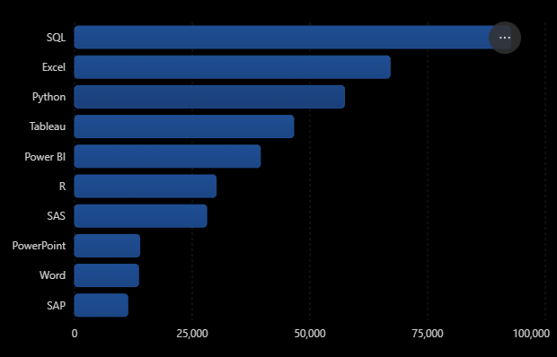
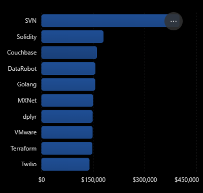
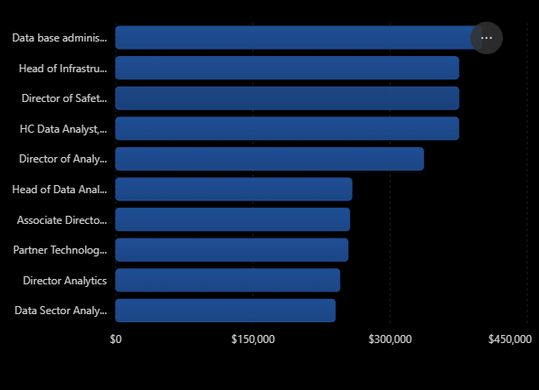
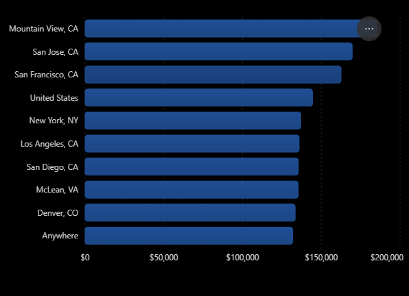
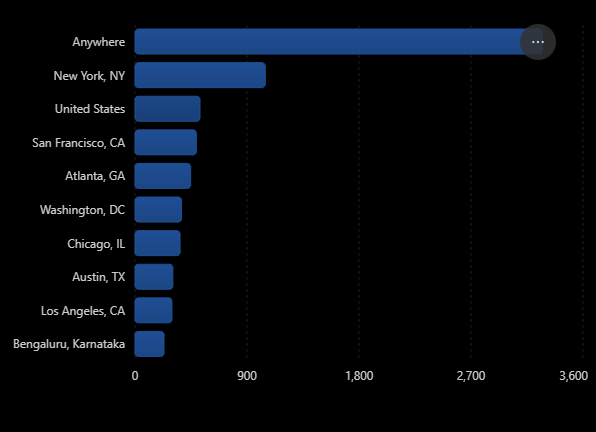
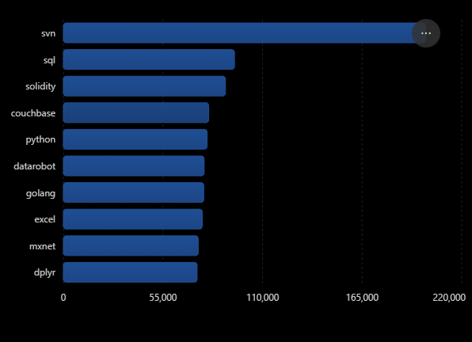

# Introduction

This SQL project analyzes Data Analyst job postings to explore the job market, identify in-demand skills, and investigate the relationship between skills and average yearly salaries.

The project answers practical questions that can help aspiring Data Analysts better understand the skills employers are looking for.

Check the SQL queries here -> [project_sql_queries folder](/project_sql_queries/)

# Background

As someone pursuing a career in data analytics, I wanted to better understand the skills employers look for when hiring Data Analysts and how those skills relate to salary opportunities.

The datasets used in this project came from [Luke Barousse's SQL Course](https://www.lukebarousse.com/sql). I used them to practice SQL and explore job-market trends, including in-demand skills, average yearly salaries, job titles, and locations.

Through this project, I aimed to apply my SQL knowledge to a practical analysis and gain a better understanding of the Data Analyst job market.

### The questions I answered through my SQL queries were:
1. What are the most in-demand skills for Data Analyst jobs?
2. Which Data Analyst skills has the highest average salaries yearly?
3. Which Data Analyst job titles have the highest average yearly salaries?
4. How do Data Analyst job postings and average salaries vary by location?
5. Which Data Analyst skills offer a combination of high demand and high average yearly salary?

# Tools I Used

- **SQL:** Used to query, filter, join, and analyze job-posting data.
- **PostgreSQL:** Used to execute SQL queries and perform data analysis.
- **Visual Studio Code:** Used to write and organize SQL queries.
- **Git:** Used for version control to track changes and manage the project during development.
- **GitHub:** Used to store and document the project.

# The Analysis

The project focuses on five questions:

### 1. What are the most in-demand skills for Data Analyst jobs?

I counted how frequently each skill appeared in Data Analyst job postings to identify the skills employers requested most often.

**SQL Query:**
```sql
SELECT
    skills_dim.skills AS skills,
    COUNT(*) AS number_of_job_postings
FROM job_postings_fact
LEFT JOIN skills_job_dim ON job_postings_fact.job_id = skills_job_dim.job_id
LEFT JOIN skills_dim ON skills_job_dim.skill_id = skills_dim.skill_id
WHERE 
    job_title_short = 'Data Analyst' AND
    skills IS NOT NULL
GROUP BY skills
ORDER BY number_of_job_postings DESC
LIMIT 10
```

**Key findings:**
- SQL ranked first with 92,628 number of job postings.



*Bar graph shows the top 10 in-demand skills for data analysts; ChatGPT generated this bar graph from my SQL query results.*

### 2. Which Data Analyst skills are associated with the highest average yearly salaries?

I calculated the average yearly salary associated with each skill, excluding postings without salary information, to explore which skills were linked to higher-paying opportunities.

**SQL Query:**
```sql
SELECT
    skills_dim.skills AS skills,
    ROUND(AVG(salary_year_avg), 2) AS avg_yearly_salary
FROM job_postings_fact
LEFT JOIN skills_job_dim ON job_postings_fact.job_id = skills_job_dim.job_id
LEFT JOIN skills_dim ON skills_job_dim.skill_id = skills_dim.skill_id
WHERE
    job_title_short = 'Data Analyst' AND
    skills IS NOT NULL AND
    salary_year_avg IS NOT NULL
GROUP BY skills
ORDER BY avg_yearly_salary DESC
LIMIT 10
```

**Key findings:**
- SVN ranked first with $400,000 average yearly salary.



*Bar graph shows the top 10 highest salary skills for data analysts; ChatGPT generated this bar graph from my SQL query results.*

### 3. Which Data Analyst job titles have the highest average yearly salaries?

I ranked average yearly salaries across Data Analyst job titles to examine how compensation differed between roles.

**SQL Query:**
```sql
SELECT
    job_title,
    ROUND(AVG(salary_year_avg), 2) AS avg_yearly_salary,
    COUNT(*) AS number_of_job_postings
FROM job_postings_fact
WHERE
    job_title_short = 'Data Analyst' AND
    salary_year_avg IS NOT NULL
GROUP BY job_title
ORDER BY avg_yearly_salary DESC
LIMIT 10
```

**Key findings:**
- Database Administrator ranked first with $400,000 average yearly salary.



*Bar graph shows the top 10 highest-paying data analyst jobs; ChatGPT generated this bar graph from my SQL query results.*

### 4. How do Data Analyst job opportunities and average salaries vary by location?

I grouped job postings by location to compare the number of job postings and average yearly salaries across different places.

**SQL Query:**
```sql
SELECT
    job_location,
    COUNT(*) AS number_of_job_postings,
    ROUND(AVG(salary_year_avg), 2) AS avg_yearly_salary
FROM job_postings_fact
WHERE
    job_location IS NOT NULL AND
    salary_year_avg IS NOT NULL
GROUP BY job_location
HAVING COUNT(*) >= 100 -- Better to use a higher number of job postings to have a more meaningful insights
ORDER BY avg_yearly_salary DESC -- Change to number_of_job_postings to make order by number of job postings
```

**Key findings:**
- Based on the two results, places like San Francisco, United States, New York, and Los Angeles are more relevant since it's shown in both results.
- Anywhere or basically remote jobs has the most offered opportunity by having the most number of job postings with 3,273. It is also included in the top 10 locations based on salary.

**Top 10 Locations Based on Salary**


**Top 10 Locations Based on Number of Job Postings**


*Bar graphs show the top 10 locations based on salary and number of job postings; ChatGPT generated this bar graph from my SQL query results.*

### 5. Which Data Analyst skills offer a combination of high demand and high average yearly salary?

To identify skills that combine demand and salary, I calculated a combined score by adding each skill's job posting count to its average yearly salary, then dividing the result by two. This provided a single metric for comparing skills based on these two factors.

**SQL Query:**
```sql
WITH skills_demand AS (
    SELECT
        skills_dim.skill_id AS id,
        COUNT(*) AS number_of_job_postings
    FROM job_postings_fact
    LEFT JOIN skills_job_dim ON job_postings_fact.job_id = skills_job_dim.job_id
    LEFT JOIN skills_dim ON skills_job_dim.skill_id = skills_dim.skill_id
    WHERE 
        job_title_short = 'Data Analyst' AND
        skills IS NOT NULL
    GROUP BY id
), skills_salary AS (
    SELECT
        skills_dim.skill_id AS id,
        ROUND(AVG(salary_year_avg), 2) AS avg_yearly_salary
    FROM job_postings_fact
    LEFT JOIN skills_job_dim ON job_postings_fact.job_id = skills_job_dim.job_id
    LEFT JOIN skills_dim ON skills_job_dim.skill_id = skills_dim.skill_id
    WHERE
        job_title_short = 'Data Analyst' AND
        skills IS NOT NULL AND
        salary_year_avg IS NOT NULL
    GROUP BY id
)

SELECT
    skills_dim.skills,
    skills_demand.number_of_job_postings,
    skills_salary.avg_yearly_salary,
    ROUND((skills_demand.number_of_job_postings + skills_salary.avg_yearly_salary)/2, 2) AS combined_score
FROM skills_dim
INNER JOIN skills_demand ON skills_dim.skill_id = skills_demand.id
INNER JOIN skills_salary ON skills_dim.skill_id = skills_salary.id
ORDER BY combined_score DESC
LIMIT 10
```

**Key findings:**
- SVN ranked first with 200,029 combined score. It still ranked first even though the skill only appeared in 58 data analyst job postings because of its high average yearly salary.

**Top 10 Combined Demand and Salary Skills**


*Bar graph shows the top 10 combined demand and salary skills; ChatGPT generated this bar graph from my SQL query results.*

# What I Learned

Having this project as my first SQL project, I strengthened my understanding of SQL and practiced applying it to a practical data-analysis problem.

Some of the key concepts I practiced include:

- Strengthened my knowledge on basic concepts of SQL, upto some advanced concepts.
- Using `JOIN` operations to combine data from multiple tables.
- Using aggregate functions such as `COUNT()` and `AVG()`.
- Grouping and sorting data with `GROUP BY` and `ORDER BY`.
- Filtering records using `WHERE` and handling `NULL` values.
- Organizing complex queries using Common Table Expressions (CTEs).

# Conclusion

This project helped me apply SQL to analyze Data Analyst job postings and explore the relationship between skills, demand, salaries, and locations.

By answering these five questions, I gained a clearer understanding of how SQL can be used to extract useful insights from a dataset. The project also gave me practical experience in structuring queries, combining tables, performing calculations, and presenting findings.

This is an important step in my journey toward becoming a Data Analyst, and I look forward to applying these skills to more projects in the future.